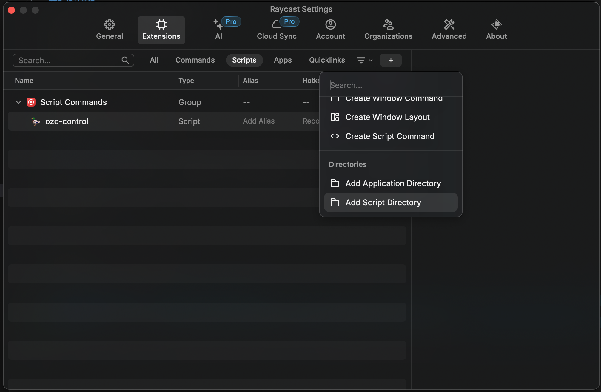
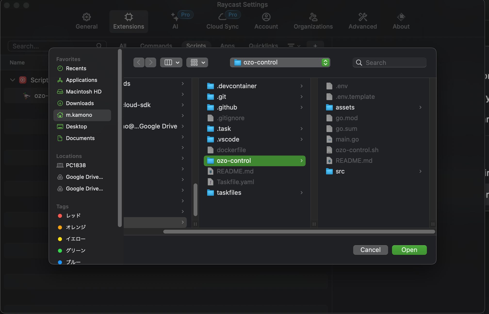
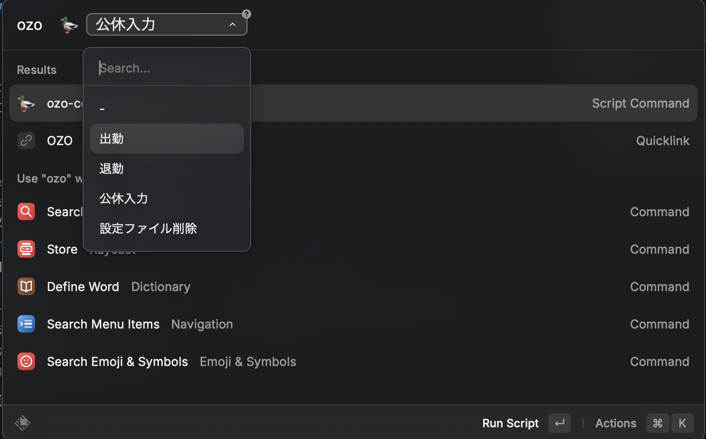

# ozo-control

## install

インストール方法は以下の2つがあります。

- curlを使用する方法
- goを使用する方法

### With curl

#### Apple Silicon Macの場合
```shell
sudo curl -o /usr/local/bin/ozo-control https://raw.githubusercontent.com/Mkamono/scripts/main/ozo-control/assets/darwin-arm64/ozo-control && \
sudo chmod +x /usr/local/bin/ozo-control
```

Uninstall

```shell
ozo-control clean && sudo rm /usr/local/bin/ozo-control
```

### With go

```shell
git clone https://github.com/Mkamono/scripts.git
cd scripts/ozo-control
go install .
```

## Quick Start

```shell
ozo-control init -u <user-id> -p <password>
```

## Usage

```shell
ozo-control --help
```

### 出勤

```shell
ozo-control i
```

or

```shell
ozo-control check-in
```

### 退勤

```shell
ozo-control o
```

or

```shell
ozo-control check-out
```

### 休日登録

デフォルトでは、日本の土日祝日を登録します。

```shell
ozo-control r
```

or

```shell
ozo-control register-holiday
```

### Override Option

Overrideオプションを使用すると、すでに登録されている休日を上書きします。

```shell
ozo-control r -o
```

or

```shell
ozo-control register-holiday -o
```

## Raycast Integration

Raycast用の[Script Command](./ozo-control.sh)を使用すると、Raycastから直接出勤、退勤、休日登録ができます。








